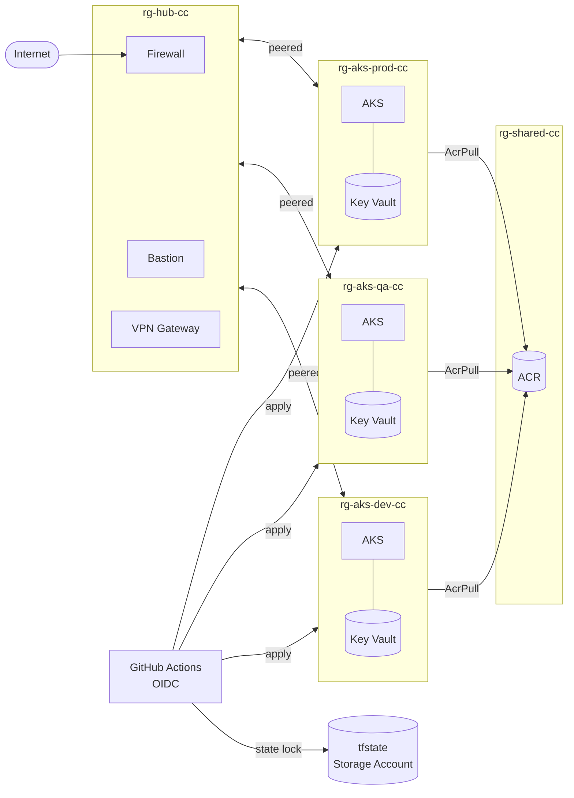

# Hub-Spoke AKS Platform — Build Guide

---

## Architecture



---

## Resource Groups

| RG | What's in it |
|---|---|
| rg-tfstate | State storage — created once by hand, never in Terraform |
| rg-hub-cc | Hub VNet, Firewall, Bastion, VPN Gateway, Log Analytics |
| rg-shared-cc | ACR — shared across all envs, one registry |
| rg-aks-dev-cc | Spoke VNet, AKS, Key Vault |
| rg-aks-qa-cc | Same |
| rg-aks-prod-cc | Same |

ACR is shared — build once, promote the same image digest dev→qa→prod.
Key Vault is per-env — a dev identity must never read a prod secret.

---

## Repo Layout

```
.
├── environments/
│   ├── shared/           # ACR — its own state file
│   ├── hub/              # hub VNet — its own state file
│   ├── dev/
│   ├── qa/
│   └── prod/
├── modules/
│   ├── networking/       # VNet, subnets, NSG, UDR, peering
│   ├── aks/              # cluster, node pools, workload identity
│   ├── acr/
│   ├── keyvault/
│   └── monitoring/
├── k8s/
│   └── stateful-app/     # StatefulSet, PVC, Services
└── .github/workflows/
    ├── plan.yml           # runs on PR, posts plan as PR comment
    └── apply.yml          # runs on merge, prod requires approval
```

---

## Every Environment Folder

```
environments/dev/
├── backend.tf        ← unique key per env, never shared
├── providers.tf
├── main.tf           ← resource group + module calls only
├── variables.tf      ← types and descriptions, no values
├── terraform.tfvars  ← only file that changes per env
└── outputs.tf
```

**backend.tf**
```hcl
terraform {
  backend "azurerm" {
    resource_group_name  = "rg-tfstate"
    storage_account_name = "<your-unique-name>"
    container_name       = "tfstate"
    key                  = "dev.terraform.tfstate"
  }
}
```
Change `key` for each env: `hub.terraform.tfstate`, `shared.terraform.tfstate`, `qa.terraform.tfstate`, `prod.terraform.tfstate`.

**providers.tf**
```hcl
terraform {
  required_providers {
    azurerm = {
      source  = "hashicorp/azurerm"
      version = "~> 5.0"
    }
  }
}

provider "azurerm" {
  features {}
  subscription_id = var.subscription_id
}
```

**main.tf** (example, dev)
```hcl
resource "azurerm_resource_group" "this" {
  name     = "rg-aks-dev-cc"
  location = "canadacentral"
}

module "networking" {
  source         = "../../modules/networking"
  resource_group = azurerm_resource_group.this.name
  location       = azurerm_resource_group.this.location
  subnets        = var.subnets
  hub_vnet_id    = var.hub_vnet_id
}

module "aks" {
  source         = "../../modules/aks"
  resource_group = azurerm_resource_group.this.name
  location       = azurerm_resource_group.this.location
  node_pools     = var.node_pools
  subnet_id      = module.networking.subnet_ids["aks"]
}
```

Rule: no `provider` block and no `backend` block inside any module, ever.
Rule: resource group is created in the environment's `main.tf`, not inside a module.

---

## Every Module Folder

```
modules/aks/
├── main.tf
├── variables.tf    # no environment-specific defaults
├── outputs.tf      # everything the caller needs: cluster id, oidc issuer url, kubelet identity
└── README.md       # generate with terraform-docs
```

---

## Subnets

**Hub — names are Azure requirements, not your choice:**

| Subnet | Min CIDR | Why |
|---|---|---|
| AzureFirewallSubnet | /26 | Firewall won't deploy without this exact name |
| AzureBastionSubnet | /26 | Same — exact name required |
| GatewaySubnet | /27 | VPN Gateway requires this exact name |

**Spoke — your design:**

| Subnet | CIDR | Why |
|---|---|---|
| snet-aks | /24 | Node pool IPs — needs room to scale |
| snet-pe | /27 | Private endpoints only — small, different NSG rules |

Use `for_each` over a map for both, not `count`:
```hcl
variable "subnets" {
  type = map(object({
    cidr = string
  }))
}

# terraform.tfvars (hub)
subnets = {
  AzureFirewallSubnet = { cidr = "10.0.0.0/26" }
  AzureBastionSubnet  = { cidr = "10.0.0.64/26" }
  GatewaySubnet       = { cidr = "10.0.0.128/27" }
}
```
Why `for_each` not `count`: you'll reference subnets by name later — `module.networking.subnet_ids["aks"]`. With `count` you'd get `[0]`, `[1]`. Insert a new subnet mid-list and Terraform reindexes, destroys, and recreates everything after it.

---

## Phase 1 — Hub + Dev Networking

**Build order:**
1. Create rg-hub-cc + hub VNet with 3 named subnets
2. Create rg-aks-dev-cc + spoke VNet with 2 subnets
3. NSG per subnet, associate to subnet
4. Route table on spoke `snet-aks`: `0.0.0.0/0 → Firewall private IP`
5. VNet peering — two separate resources, both directions:

```hcl
# hub → spoke
resource "azurerm_virtual_network_peering" "hub_to_spoke" {
  name                      = "hub-to-dev"
  resource_group_name       = "rg-hub-cc"
  virtual_network_name      = azurerm_virtual_network.hub.name
  remote_virtual_network_id = azurerm_virtual_network.spoke_dev.id
  allow_gateway_transit     = true   # hub shares its gateway with spokes
}

# spoke → hub
resource "azurerm_virtual_network_peering" "spoke_to_hub" {
  name                      = "dev-to-hub"
  resource_group_name       = "rg-aks-dev-cc"
  virtual_network_name      = azurerm_virtual_network.spoke_dev.name
  remote_virtual_network_id = azurerm_virtual_network.hub.id
  use_remote_gateways       = false  # set true only after VPN GW exists in Phase 6
}
```

**Gotchas:**
- Two peering resources — not one. Forgetting one direction leaves the peering in "Initiated" not "Connected"
- Do not set `use_remote_gateways = true` until the VPN Gateway actually exists or peering will fail

**Done:**
```bash
az network vnet peering list -g rg-hub-cc --vnet-name vnet-hub-cc -o table
# both rows show "Connected"
```

---

## Phase 2 — AKS in Dev Spoke

**Cluster:**
```hcl
resource "azurerm_kubernetes_cluster" "this" {
  name                    = "aks-dev-01-cc"
  location                = var.location
  resource_group_name     = var.resource_group
  dns_prefix              = "aks-dev"
  private_cluster_enabled = true
  oidc_issuer_enabled     = true
  workload_identity_enabled = true

  default_node_pool {
    name           = "system"
    node_count     = 1
    vm_size        = "Standard_D2s_v3"
    vnet_subnet_id = var.subnet_id
  }

  identity {
    type = "SystemAssigned"
  }

  network_profile {
    network_plugin = "azure"
    network_policy = "azure"
  }
}
```

**Additional node pools via for_each:**
```hcl
resource "azurerm_kubernetes_cluster_node_pool" "this" {
  for_each              = var.node_pools
  name                  = each.key
  kubernetes_cluster_id = azurerm_kubernetes_cluster.this.id
  vm_size               = each.value.vm_size
  node_count            = each.value.count
  vnet_subnet_id        = var.subnet_id
}

# terraform.tfvars
node_pools = {
  user = { vm_size = "Standard_D2s_v3", count = 1 }
}
```

**Workload identity:**
```hcl
resource "azurerm_user_assigned_identity" "workload" {
  name                = "id-workload-dev"
  resource_group_name = var.resource_group
  location            = var.location
}

resource "azurerm_federated_identity_credential" "workload" {
  name                = "federated-workload"
  resource_group_name = var.resource_group
  parent_id           = azurerm_user_assigned_identity.workload.id
  issuer              = azurerm_kubernetes_cluster.this.oidc_issuer_url
  subject             = "system:serviceaccount:<namespace>:<serviceaccount-name>"
  audience            = ["api://AzureADTokenExchange"]
}
```

**ACR pull — role assignment, not a password:**
```hcl
resource "azurerm_role_assignment" "acr_pull" {
  scope                = var.acr_id
  role_definition_name = "AcrPull"
  principal_id         = azurerm_kubernetes_cluster.this.kubelet_identity[0].object_id
}
```

**Gotchas:**
- Cluster identity ≠ workload identity. Cluster identity = control plane talking to Azure. Workload identity = your pods talking to Azure via OIDC token exchange.
- `oidc_issuer_enabled` must be true before the federated credential can be created — Terraform resolves the order automatically from the reference, don't manually sort.
- Private cluster = `kubectl` from your laptop will 403. You access it through Bastion + a jumpbox VM in `AzureBastionSubnet`.
- Federated credential `subject` is an exact string match — wrong namespace or service account name = silent 403 on token exchange.

**Done:**
```bash
kubectl get nodes
kubectl get sa <sa-name> -n <namespace> -o yaml | grep azure.workload.identity
```

---

## Phase 3 — Stateful Workload on AKS

**StatefulSet (Postgres example):**
```yaml
apiVersion: apps/v1
kind: StatefulSet
metadata:
  name: db
  namespace: app
spec:
  serviceName: db-headless
  replicas: 1
  selector:
    matchLabels:
      app: db
  template:
    metadata:
      labels:
        app: db
    spec:
      containers:
      - name: postgres
        image: <acr-name>.azurecr.io/postgres:15
        env:
        - name: POSTGRES_PASSWORD
          value: "changeme"
        volumeMounts:
        - name: data
          mountPath: /var/lib/postgresql/data
  volumeClaimTemplates:
  - metadata:
      name: data
    spec:
      accessModes: ["ReadWriteOnce"]
      storageClassName: managed-csi
      resources:
        requests:
          storage: 5Gi
```

**Headless Service — gives each pod a stable DNS name:**
```yaml
apiVersion: v1
kind: Service
metadata:
  name: db-headless
  namespace: app
spec:
  clusterIP: None
  selector:
    app: db
```
Pod DNS: `db-0.db-headless.app.svc.cluster.local`

**Internal Load Balancer — app reaches the outside without a public IP:**
```yaml
apiVersion: v1
kind: Service
metadata:
  name: app
  namespace: app
  annotations:
    service.beta.kubernetes.io/azure-load-balancer-internal: "true"
spec:
  type: LoadBalancer
  selector:
    app: app
  ports:
  - port: 80
```

**Gotchas:**
- Run `kubectl get storageclass` before using `managed-csi` — verify the name on your cluster
- Each replica gets its own PVC: `data-db-0`, `data-db-1`. They never share.
- Deleting the StatefulSet does NOT delete the PVCs. Manual `kubectl delete pvc` needed during teardown.
- Miss the `azure-load-balancer-internal` annotation = public IP by default.

**Done:**
```bash
kubectl get statefulset,pvc,pv -n app
kubectl delete pod db-0 -n app && kubectl exec -it db-0 -n app -- psql -U postgres -c "\l"
# data survives the pod restart
```

---

## Phase 4 — Clone to QA and Prod

1. Copy `environments/dev/` → `environments/qa/` and `environments/prod/`
2. Change only two things per copy:
   - `backend.tf`: update `key` to `qa.terraform.tfstate` / `prod.terraform.tfstate`
   - `terraform.tfvars`: update values

**Example tfvars difference:**
```hcl
# dev/terraform.tfvars
aks_node_count = 1
aks_vm_size    = "Standard_D2s_v3"

# prod/terraform.tfvars
aks_node_count = 3
aks_vm_size    = "Standard_D4s_v3"
```

Nothing else changes. Same modules. Same variables.tf.

**If your module has `if var.environment == "prod"` inside it — the design is wrong.** That logic belongs in the calling environment's tfvars, not the module. The module takes inputs, it doesn't make environment decisions.

**Gotchas:**
- Workspaces are NOT the right tool here. Workspace = same state file = easy to apply wrong env by mistake. Separate directories = separate state files = separate blast radius.
- Three state files is the technical control. Destroying dev cannot touch prod.

**Done:**
```bash
az storage blob list --container-name tfstate --account-name <name> -o table
# shows: dev.terraform.tfstate, qa.terraform.tfstate, prod.terraform.tfstate
terraform destroy  # in environments/dev
# terraform plan in qa and prod shows zero diff
```

---

## Phase 5 — CI/CD

**OIDC federated credential for GitHub Actions — no stored secrets:**
```hcl
resource "azurerm_federated_identity_credential" "github_prod" {
  name                = "github-prod"
  resource_group_name = var.resource_group
  parent_id           = azurerm_user_assigned_identity.ci.id
  issuer              = "https://token.actions.githubusercontent.com"
  subject             = "repo:<org>/<repo>:environment:prod"
  audience            = ["api://AzureADTokenExchange"]
}
```
Use `environment:prod` for prod, `ref:refs/heads/main` for dev/qa.

**plan.yml** (runs on every PR):
```yaml
name: Plan
on: [pull_request]
jobs:
  plan:
    runs-on: ubuntu-latest
    permissions:
      id-token: write
      contents: read
      pull-requests: write
    steps:
    - uses: actions/checkout@v4
    - uses: azure/login@v2
      with:
        client-id: ${{ vars.AZURE_CLIENT_ID }}
        tenant-id: ${{ vars.AZURE_TENANT_ID }}
        subscription-id: ${{ vars.AZURE_SUBSCRIPTION_ID }}
    - uses: hashicorp/setup-terraform@v3
    - run: terraform fmt -check
    - run: terraform init
    - run: terraform validate
    - run: trivy config .
    - id: plan
      run: terraform plan -no-color -out=tfplan
    - uses: actions/github-script@v7
      with:
        script: |
          const plan = `${{ steps.plan.outputs.stdout }}`;
          github.rest.issues.createComment({ issue_number: context.issue.number,
            owner: context.repo.owner, repo: context.repo.repo,
            body: `\`\`\`\n${plan}\n\`\`\`` });
```

**apply.yml** (runs on merge to main):
```yaml
name: Apply
on:
  push:
    branches: [main]
jobs:
  apply-dev:
    runs-on: ubuntu-latest
    steps:
    - run: terraform apply -auto-approve

  apply-prod:
    needs: apply-dev
    environment: prod          # this line triggers the GitHub approval gate
    runs-on: ubuntu-latest
    steps:
    - run: terraform apply -auto-approve
```

In GitHub: Settings → Environments → prod → Required reviewers → add yourself.

**Gotchas:**
- Run order matters: `fmt -check` → `validate` → `trivy` → `plan` → approval → `apply`. If you security scan after plan you've already done the expensive operation.
- Store client ID, tenant ID, subscription ID as GitHub Actions **vars** (not secrets — they're not sensitive). Only the OIDC token exchange is the security mechanism.
- Trivy replaces tfsec — tfsec is deprecated and folded into Trivy. Command: `trivy config .`

**Done:**
- Open a PR touching `environments/dev/` → plan comment appears on the PR automatically
- Merge to main → dev applies without approval, prod job pauses and waits for your click

---

## Phase 6 — VPN Gateway + BGP (Stretch)

```hcl
resource "azurerm_virtual_network_gateway" "hub" {
  name                = "vpng-hub-cc"
  resource_group_name = "rg-hub-cc"
  location            = "canadacentral"
  type                = "Vpn"
  vpn_type            = "RouteBased"
  sku                 = "VpnGw1"      # Basic does not support BGP

  bgp_settings {
    asn = 65001
  }

  ip_configuration {
    subnet_id            = azurerm_subnet.this["GatewaySubnet"].id
    public_ip_address_id = azurerm_public_ip.gw.id
  }
}
```

After gateway is up, update the spoke peering:
```hcl
# in spoke peering resource
use_remote_gateways = true   # now that the gateway exists, enable this
```

**Gotchas:**
- Provisioning takes 30-45 min — start it, do something else
- `terraform destroy` this the same day — it bills hourly even when idle
- BGP route vs UDR conflict: more specific prefix wins. Equal prefix: UDR beats BGP-learned route.

**Done:**
```bash
az network vnet-gateway list-bgp-peer-status -g rg-hub-cc -n vpng-hub-cc -o table
# peer state: Connected
```

---

## Interview Answers

| Question | Answer |
|---|---|
| `count` vs `for_each` | `for_each` when you reference by name later. `count` only for on/off conditionals. Wrong call = inserting an item mid-list reindexes and destroys everything after it |
| Workspaces vs directories | Directories for real envs — separate state, separate blast radius. Workspaces only for ephemeral same-day throwaway envs |
| State locking mechanism | azurerm backend acquires a blob lease before writing. Stuck lock = `terraform force-unlock <lock-id>` |
| Cluster identity vs workload identity | Cluster identity = control plane authenticates to Azure. Workload identity = pods authenticate to Azure via OIDC token exchange |
| StatefulSet vs Deployment | StatefulSet gives stable pod name, stable DNS, and its own PVC per replica. Deployment pods are interchangeable |
| BGP vs static UDR | BGP auto-propagates routes and fails over. Static UDR is manual and won't update if the next-hop dies |
